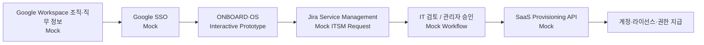
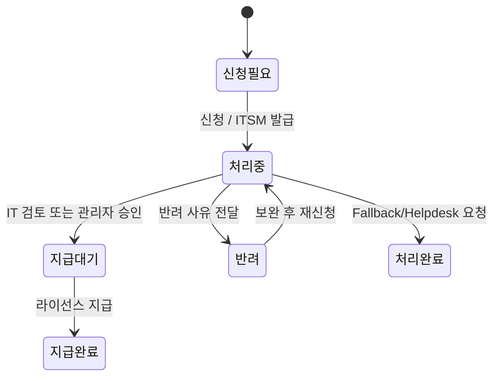

# ONBOARD·OS

[](https://github.com/dohyunkimmm/onboardos/actions/workflows/e2e.yml?query=branch%3Amain)

신규입사자가 직무에 맞는 SaaS·업무 도구를 확인하고, 라이선스 **신청 → 검토·승인 → 지급 완료**까지의 흐름을 직접 체험할 수 있도록 설계한 인터랙티브 온보딩 포털 프로토타입입니다.

## Start Here

| 보고 싶은 것 | 바로 보기 | 핵심 확인 포인트 |
| --- | --- | --- |
| **36초 핵심 Flow** | [Production Demo →](https://onboardos-rho.vercel.app/production-demo) | 직무 선택 → 신청 → ITSM/SLA → 관리자 처리 → 지급 완료 |
| **2–3분 직접 체험** | [Live Production →](https://onboardos-rho.vercel.app/) | 사용자/관리자 상태 일관성, 반려·재신청, 예외 Flow |
| **설계·운영 근거** | [Case Study →](https://dohyunkimm.notion.site/SaaS-38521460c93481498afce73336d4a17a) | 문제 정의, 운영 정책, QA·Production evidence |

**추천 순서:** 36초 영상으로 핵심을 먼저 확인한 뒤 → Live Production에서 직접 체험 → 필요하면 Case Study와 검증 근거를 확인합니다. [2–3분 Demo Walkthrough](./docs/DEMO_WALKTHROUGH.md) · [Latest main verification](https://github.com/dohyunkimmm/onboardos/actions/workflows/e2e.yml?query=branch%3Amain+event%3Apush) · [Verification Matrix](#verification-matrix) · [Manual Production Verify](https://github.com/dohyunkimmm/onboardos/actions/workflows/production-verify.yml) · [Release Notes](./CHANGELOG.md)

> **Portfolio release — v15.0.0 / P6 Production verified.** P6에서 동결한 제품 기능과 사용자·관리자 Business Flow는 그대로 유지하고, v15.0.0은 post-login 화면의 visual polish와 density rhythm을 정교화했습니다. 공통 라이선스 compact density, overview→filter→license section의 세로 리듬, 카드 상태·CTA hierarchy, modal/drawer spacing과 tablet/mobile scanability를 다듬었으며 JavaScript business logic, catalog data, request-state machine, role isolation은 변경하지 않았습니다. R/S/U/V/D/E 1–8 계약과 Production integrity/smoke를 유지합니다. [GitHub Release v15.0.0](https://github.com/dohyunkimmm/onboardos/releases/tag/v15.0.0) · [Live Production](https://onboardos-rho.vercel.app/)

> 포트폴리오용 가상 데이터 기반 프로토타입입니다. Google SSO, Google Workspace 조직·직무 정보, Jira Service Management, SaaS Provisioning API는 실제 운영 환경을 가정한 Mock Flow이며 실제 계정·티켓 시스템과 연결되어 있지 않습니다.


## 2–3분 Demo Route

1. **로그인·직무 개인화** — 가상 Google SSO → 경영지원·총무 선택 → 전사 공통/직무별 라이선스와 자동 지급·신청·승인 필요 구분 확인
2. **신청·처리** — Microsoft Office 신청 → 사용자 ITSM/SLA 확인 → 관리자 체험에서 동일 티켓 검토/승인 → 지급 완료
3. **예외·상태 일관성** — 반려→보완 재신청, 직무 미매핑/목록 외 Fallback, 직무 전환 후 상태 격리·복원 확인
4. **검증 Evidence** — README Verification Matrix와 최신 `main` GitHub Actions에서 54개 회귀·Desktop/Mobile Lighthouse·Production smoke·SHA-256 integrity 확인

[**36초 Production Demo**](https://onboardos-rho.vercel.app/production-demo)는 Vercel의 웹 플레이어에서 바로 재생되며, 영상 원본은 `v15.0.0` GitHub Release asset으로 유지합니다. GitHub Actions가 실제 Vercel Production URL을 Playwright Chromium으로 조작해 녹화하고, Release asset은 FFmpeg/ffprobe로 **정확히 36초**인지 검증합니다. 제품 Flow 이후의 Verification Evidence 화면은 영상에서 제외했고, 녹화 중 Analytics·Speed Insights endpoint는 intercept하여 synthetic 트래픽이 실제 사용 지표에 섞이지 않도록 합니다. 화면 녹화용 shot list와 설명 문구는 [`docs/DEMO_WALKTHROUGH.md`](./docs/DEMO_WALKTHROUGH.md)에 정리했습니다.

## 주요 기능

- **가상 Google SSO 로그인** — 신규입사자 인증 시나리오 체험
- **직무별 라이선스 노출** — 디자인 / 개발 / 데이터 / 경영지원·총무 / 직무 미매핑 시나리오
- **전사 공통 + 직무별 추가 라이선스 구분** — 자동 지급과 신청·승인 필요 항목 분리
- **라이선스 신청 Flow** — 신청 사유, 예상 지급일, 담당 부서, SLA 확인
- **신청현황 Tracking** — 요청번호, 처리 상태, 이력, 반려 사유 확인
- **관리자 체험** — 검토, 승인, 반려, 지급 완료와 보완 대기 KPI
- **재신청 Flow** — 반려 사유 확인 → 보완 내용 입력 → 동일 요청 이력 기반 재접수
- **Fallback Flow** — 직무 미매핑과 목록 외 라이선스도 데모 ITSM 요청번호를 발급해 사용자/관리자에서 동일하게 추적
- **State Consistency** — 사용자/관리자에서 동일 요청 상태·티켓·이력 유지
- **Role-isolated Scenario State** — 직무 Preview마다 신청·취소·이력을 독립 저장하고, 직무를 다시 선택해도 해당 시나리오 상태만 복원
- **Fault-tolerant Session Recovery** — 손상된 세션·구버전 데이터·Storage 장애에서도 안전한 초기 상태 또는 유효 상태로 복구
- **SLA 상태** — 정상 / 마감 임박 / 초과 / 완료 상태를 같은 기준으로 표시
- **세션 상태 유지** — `sessionStorage` 기반 체험 상태 유지 및 명시적 초기화
- **Responsive & Accessibility** — PC/태블릿/모바일, focus trap, `aria-*`, `inert`, ESC 닫기, skip link, reduced motion + axe 자동 검사

## Prototype Architecture



## State Model



각 직무 Preview는 위 상태 모델을 공유하지만 실제 요청 데이터는 **직무별 state bucket**으로 격리합니다. 기존 `onboard-os:v3` 세션은 `v4`로 읽을 때 당시 선택 직무의 상태로 1회 마이그레이션하며, malformed session payload는 유효한 요청만 보존하고 복구 불가능한 데이터는 안전하게 폐기합니다.

## SLA 기준

- 자동 지급: 계정 생성 후 **1시간 이내**
- 신청 필요: 영업일 기준 **D+1~2**
- 승인 필요: 영업일 기준 **D+2~3**

프로토타입의 영업일 계산은 **주말만 제외**합니다. 실제 운영 시에는 회사 영업일·공휴일 Calendar와 조직의 기준 시간대를 적용하는 것을 전제로 합니다.

## Tech Stack

- HTML5 / CSS3 / Vanilla JavaScript
- `sessionStorage`
- Pretendard Variable Dynamic Subset self-hosting (SIL Open Font License 1.1)
- Vercel Web Analytics custom events
- Playwright E2E / axe WCAG A·AA / ARIA Snapshot / Visual Regression
- Firefox·WebKit Cross-browser Smoke / Desktop Chromium·iPhone WebKit Production Smoke
- Lighthouse 13.4.1 · Desktop + Mobile 각 3-run Performance Budget
- Fault Injection & Recovery Contract
- SHA-256 Production Asset Integrity
- Canonical Machine-readable Release + Integrity Contract (`release.json` → `integrity-assets.json` → recursive public-asset discovery)
- npm audit / PR Dependency Delta Review / Dependabot
- GitHub Actions Quality Gate + Manual Production Verify + Public Verification Evidence
- Playwright Production Demo Recorder + Vercel web player + GitHub Release asset
- GitHub → Vercel Production

프레임워크 없이 정적 웹 구조로 구현했으며, Vercel Production은 GitHub `main` 브랜치와 연결되어 있습니다. Pretendard는 런타임 CDN 호출 없이 저장소의 subset 파일을 직접 제공합니다.

## Project Structure

```text
.
├── index.html
├── production-demo.html
├── version.txt
├── release.json
├── integrity-assets.json
├── styles.css
├── login-font-lock.css
├── data.js
├── js/
│   ├── state.js
│   ├── analytics.js
│   ├── a11y.js
│   └── events.js
├── app.js
├── og-image.png
├── icons/
│   └── *.svg
├── fonts/
│   ├── pretendard.css
│   ├── PRETENDARD-LICENSE.txt
│   └── pretendard/
│       └── *.woff2
├── scripts/
│   ├── quality-check.js
│   ├── release-contract.js
│   ├── public-assets.js
│   ├── serve.js
│   ├── lighthouse-run.js
│   ├── asset-integrity.js
│   ├── verification-summary.js
│   ├── release-evidence.js
│   ├── resilience-summary.js
│   └── record-demo.mjs
├── tests/
│   ├── onboard.spec.js
│   ├── accessibility.spec.js
│   ├── aria.spec.js
│   ├── aria.spec.js-snapshots/
│   ├── keyboard.spec.js
│   ├── domain.spec.js
│   ├── role-isolation.spec.js
│   ├── recovery.spec.js
│   ├── cross-browser.spec.js
│   ├── production.spec.js
│   ├── visual.spec.js
│   └── visual.spec.js-snapshots/
├── docs/
│   └── DEMO_WALKTHROUGH.md
├── playwright.config.js
├── playwright.resilience.config.js
├── playwright.cross-browser.config.js
├── playwright.production.config.js
├── lighthouserc.cjs
├── lighthouserc.mobile.cjs
├── package.json
├── package-lock.json
├── CHANGELOG.md
├── .github/
│   ├── dependabot.yml
│   └── workflows/
│       ├── e2e.yml
│       ├── production-verify.yml
│       └── release.yml
├── vercel.json
└── README.md
```

## Local Run

```bash
python3 -m http.server 8000
```

브라우저에서 `http://localhost:8000`으로 접속합니다.

## E2E QA

```bash
npm ci
npm audit --audit-level=high
npx playwright install chromium firefox webkit
npm run quality
npm run test:e2e
npm run test:resilience
npm run test:cross-browser
npm run test:lighthouse
npm run test:lighthouse:mobile
```

Playwright는 Desktop Chromium과 Mobile Chromium에서 기능·접근성·상태 정책·직무 격리·Fault Injection/Recovery·Visual Regression을 포함한 **54개 회귀 테스트**를 실행합니다. 핵심 Business/Recovery Flow는 다음과 같습니다.

- 신청 → IT 검토 → 지급 완료 → reload 후 session 유지
- 승인 필요 → 반려 → 보완 → 재신청 → 관리자 승인
- 직무 미매핑 → ITSM 요청 생성 → 관리자 처리 완료
- 목록 외 라이선스 → IT 헬프데스크 ITSM 요청 생성
- 경영지원·총무에서 생성한 요청 → 디자인 직무에서 미노출 → reload → 경영지원·총무 복귀 시 동일 티켓 복원
- corrupt v4 JSON → 안전한 초기화 → 새 정상 session 저장
- malformed nested request / malformed v3 migration → 잘못된 상태 폐기 후 정상 dashboard 유지
- `sessionStorage` read/write/remove 장애 → 핵심 신청 Flow 지속
- Analytics / Speed Insights 장애 → 업무 Flow와 독립적으로 정상 동작

PR 및 `main` push에서 GitHub Actions가 데이터·CSP·self-hosted font·workflow pinning을 포함한 Fast Quality Gate와 high 이상 npm advisory Gate를 실행하고, 이후 Chromium functional/WCAG/keyboard/ARIA/domain/role isolation/visual regression, R1–R8 Resilience/Recovery, S1–S8 Security/Failure-containment, U1–U8 Interaction UX/Accessibility, V1–V8 Visual System/Usability, D1–D8 Design Polish/Responsive Hierarchy, E1–E8 Experience Refinement, Firefox/WebKit smoke, Desktop/Mobile Lighthouse, supply-chain, Production source integrity, Desktop Chromium + iPhone WebKit smoke를 검증합니다.

## Verification Matrix

| 영역 | 검증 |
| --- | --- |
| 기능 / 상태 | Chromium functional regression · domain/state contract · role isolation |
| 접근성 | axe WCAG A·AA · keyboard · ARIA snapshot · reduced motion |
| 회복탄력성 | R1–R8 Fault Injection / Recovery |
| 보안 / 장애 격리 | S1–S8 Security / Failure-containment |
| Interaction UX | U1–U8 loading/focus/error/retry/modal/drawer/resubmit |
| Visual System | V1–V8 focus/pressed/selected/modal/drawer/forced-colors/touch |
| Design Polish | D1–D8 hierarchy/card/modal/mobile/tablet density |
| Experience Refinement | E1–E8 navigation/overview/filter/card/modal/tablet/empty-state |
| Cross-browser | Firefox / WebKit functional smoke |
| Performance | Lighthouse 13.4.1 Desktop + Mobile 3-run budget |
| Supply-chain | npm audit · dependency delta · Dependabot |
| Production | source integrity · Desktop Chromium + iPhone WebKit smoke |

## Release

Canonical release metadata는 [`release.json`](./release.json)입니다. `version.txt`, `package.json`, `package-lock.json`, `production-demo.html`, `README.md`, `CHANGELOG.md`, `RELEASE-v15.0.0.md`가 같은 버전으로 동기화되며, Release workflow는 Production-verified target SHA의 evidence를 검증한 뒤 immutable GitHub Release와 정확히 36초 Production Demo asset을 발행합니다.

현재 정식 Release: **v15.0.0** — [GitHub Release](https://github.com/dohyunkimmm/onboardos/releases/tag/v15.0.0)
