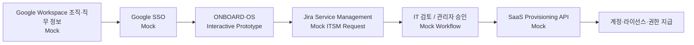
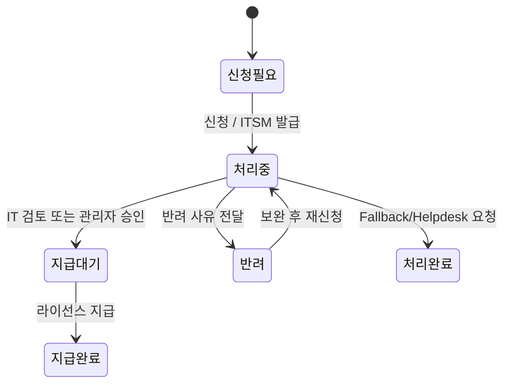

# ONBOARD·OS

[](https://github.com/dohyunkimmm/onboardos/actions/workflows/e2e.yml?query=branch%3Amain)

[Latest main verification runs](https://github.com/dohyunkimmm/onboardos/actions/workflows/e2e.yml?query=branch%3Amain+event%3Apush) · [Verification Matrix](#verification-matrix) · [Live Production](https://onboardos-rho.vercel.app/) · [Case Study / 운영 정책](https://dohyunkimm.notion.site/SaaS-38521460c93481498afce73336d4a17a) · [Release Notes](./CHANGELOG.md) · [36초 Production Demo](https://onboardos-rho.vercel.app/production-demo) · [2–3분 Demo Walkthrough](./docs/DEMO_WALKTHROUGH.md)

신규입사자가 직무에 맞는 SaaS·업무 도구를 확인하고, 라이선스 **신청 → 검토·승인 → 지급 완료**까지의 흐름을 직접 체험할 수 있도록 설계한 인터랙티브 온보딩 포털 프로토타입입니다.

> **Portfolio freeze — v1.7.0 / P6 verified.** 현재 기술 범위는 P6에서 동결하며, 이후에는 기능 확장보다 실제 사용 피드백·버그 수정·문서 정확성 유지를 우선합니다. 최종 `main`은 Chromium 회귀·Firefox/WebKit·Desktop/Mobile Lighthouse·Production Desktop Chromium+iPhone WebKit smoke·SHA-256 deployment integrity까지 검증합니다.

> 포트폴리오용 가상 데이터 기반 프로토타입입니다. Google SSO, Google Workspace 조직·직무 정보, Jira Service Management, SaaS Provisioning API는 실제 운영 환경을 가정한 Mock Flow이며 실제 계정·티켓 시스템과 연결되어 있지 않습니다.


## 2–3분 Demo Route

1. **로그인·직무 개인화** — 가상 Google SSO → 경영지원·총무 선택 → 전사 공통/직무별 라이선스와 자동 지급·신청·승인 필요 구분 확인
2. **신청·처리** — Microsoft Office 신청 → 사용자 ITSM/SLA 확인 → 관리자 체험에서 동일 티켓 검토/승인 → 지급 완료
3. **예외·상태 일관성** — 반려→보완 재신청, 직무 미매핑/목록 외 Fallback, 직무 전환 후 상태 격리·복원 확인
4. **검증 Evidence** — README Verification Matrix와 최신 `main` GitHub Actions에서 54개 회귀·Desktop/Mobile Lighthouse·Production smoke·SHA-256 integrity 확인

[**36초 Production Demo**](https://onboardos-rho.vercel.app/production-demo)는 Vercel의 웹 플레이어에서 바로 재생되며, 영상 원본은 `v1.7.0` GitHub Release asset으로 유지합니다. GitHub Actions가 실제 Vercel Production URL을 Playwright Chromium으로 조작해 녹화하고, Release asset은 FFmpeg/ffprobe로 **정확히 36초**인지 검증합니다. 제품 Flow 이후의 Verification Evidence 화면은 영상에서 제외했고, 녹화 중 Analytics·Speed Insights endpoint는 intercept하여 synthetic 트래픽이 실제 사용 지표에 섞이지 않도록 합니다. 화면 녹화용 shot list와 설명 문구는 [`docs/DEMO_WALKTHROUGH.md`](./docs/DEMO_WALKTHROUGH.md)에 정리했습니다.

## 주요 기능

- **가상 Google SSO 로그인** — 신규입사자 인증 시나리오 체험
- **직무별 라이선스 노출** — 디자인 / 개발 / 데이터 / 경영지원·총무 / 직무 미매핑 시나리오
- **전사 공통 + 직무별 추가 라이선스 구분** — 자동 지급과 신청·승인 필요 항목 분리
- **라이선스 신청 Flow** — 신청 사유, 예상 지급일, 담당 부서, SLA 확인
- **신청현황 Tracking** — 요청번호, 처리 상태, 이력, 반려 사유 확인
- **관리자 체험** — 검토, 승인, 반려, 지급 완료와 보완 대기 KPI
- **재신청 Flow** — 반려 사유 확인 → 보완 내용 입력 → 동일 요청 이력 기반 재접수
- **Fallback Flow** — 직무 미매핑과 목록 외 라이선스도 데모 ITSM 요청번호를 발급해 사용자/관리자에서 동일하게 추적
- **State Consistency** — 사용자/관리자에서 동일 요청 상태·티켓·이력 유지
- **Role-isolated Scenario State** — 직무 Preview마다 신청·취소·이력을 독립 저장하고, 직무를 다시 선택해도 해당 시나리오 상태만 복원
- **Fault-tolerant Session Recovery** — 손상된 세션·구버전 데이터·Storage 장애에서도 안전한 초기 상태 또는 유효 상태로 복구
- **SLA 상태** — 정상 / 마감 임박 / 초과 / 완료 상태를 같은 기준으로 표시
- **세션 상태 유지** — `sessionStorage` 기반 체험 상태 유지 및 명시적 초기화
- **Responsive & Accessibility** — PC/태블릿/모바일, focus trap, `aria-*`, `inert`, ESC 닫기, skip link, reduced motion + axe 자동 검사

## Prototype Architecture



## State Model



각 직무 Preview는 위 상태 모델을 공유하지만 실제 요청 데이터는 **직무별 state bucket**으로 격리합니다. 기존 `onboard-os:v3` 세션은 `v4`로 읽을 때 당시 선택 직무의 상태로 1회 마이그레이션하며, malformed session payload는 유효한 요청만 보존하고 복구 불가능한 데이터는 안전하게 폐기합니다.

## SLA 기준

- 자동 지급: 계정 생성 후 **1시간 이내**
- 신청 필요: 영업일 기준 **D+1~2**
- 승인 필요: 영업일 기준 **D+2~3**

프로토타입의 영업일 계산은 **주말만 제외**합니다. 실제 운영 시에는 회사 영업일·공휴일 Calendar와 조직의 기준 시간대를 적용하는 것을 전제로 합니다.

## Tech Stack

- HTML5 / CSS3 / Vanilla JavaScript
- `sessionStorage`
- Pretendard Variable Dynamic Subset self-hosting (SIL Open Font License 1.1)
- Vercel Web Analytics custom events
- Playwright E2E / axe WCAG A·AA / ARIA Snapshot / Visual Regression
- Firefox·WebKit Cross-browser Smoke / Desktop Chromium·iPhone WebKit Production Smoke
- Lighthouse 13.4.1 · Desktop + Mobile 각 3-run Performance Budget
- Fault Injection & Recovery Contract
- SHA-256 Production Asset Integrity
- npm audit / PR Dependency Delta Review / Dependabot
- GitHub Actions Quality Gate + Public Verification Evidence
- Playwright Production Demo Recorder + Vercel web player + GitHub Release asset
- GitHub → Vercel Production

프레임워크 없이 정적 웹 구조로 구현했으며, Vercel Production은 GitHub `main` 브랜치와 연결되어 있습니다. Pretendard는 런타임 CDN 호출 없이 저장소의 subset 파일을 직접 제공합니다.

## Project Structure

```text
.
├── index.html
├── production-demo.html
├── styles.css
├── data.js
├── js/
│   ├── state.js
│   ├── analytics.js
│   ├── a11y.js
│   └── events.js
├── app.js
├── og-image.png
├── icons/
│   └── *.svg
├── fonts/
│   ├── pretendard.css
│   ├── PRETENDARD-LICENSE.txt
│   └── pretendard/
│       └── *.woff2
├── scripts/
│   ├── quality-check.js
│   ├── serve.js
│   ├── lighthouse-run.js
│   ├── asset-integrity.js
│   ├── verification-summary.js
│   └── record-demo.mjs
├── tests/
│   ├── onboard.spec.js
│   ├── accessibility.spec.js
│   ├── aria.spec.js
│   ├── aria.spec.js-snapshots/
│   ├── keyboard.spec.js
│   ├── domain.spec.js
│   ├── role-isolation.spec.js
│   ├── recovery.spec.js
│   ├── cross-browser.spec.js
│   ├── production.spec.js
│   ├── visual.spec.js
│   └── visual.spec.js-snapshots/
├── docs/
│   └── DEMO_WALKTHROUGH.md
├── playwright.config.js
├── playwright.cross-browser.config.js
├── playwright.production.config.js
├── lighthouserc.cjs
├── lighthouserc.mobile.cjs
├── package.json
├── package-lock.json
├── CHANGELOG.md
├── .github/
│   ├── dependabot.yml
│   ├── demo-video-request.json
│   └── workflows/
│       ├── e2e.yml
│       ├── release.yml
│       └── demo-video.yml
├── vercel.json
└── README.md
```

## Local Run

```bash
python3 -m http.server 8000
```

브라우저에서 `http://localhost:8000`으로 접속합니다.

## E2E QA

```bash
npm ci
npm audit --audit-level=high
npx playwright install chromium firefox webkit
npm run quality
npm run test:e2e
npm run test:cross-browser
npm run test:lighthouse
npm run test:lighthouse:mobile
```

Playwright는 Desktop Chromium과 Mobile Chromium에서 기능·접근성·상태 정책·직무 격리·Fault Injection/Recovery·Visual Regression을 포함한 **54개 회귀 테스트**를 실행합니다. 핵심 Business/Recovery Flow는 다음과 같습니다.

- 신청 → IT 검토 → 지급 완료 → reload 후 session 유지
- 승인 필요 → 반려 → 보완 → 재신청 → 관리자 승인
- 직무 미매핑 → ITSM 요청 생성 → 관리자 처리 완료
- 목록 외 라이선스 → IT 헬프데스크 ITSM 요청 생성
- 경영지원·총무에서 생성한 요청 → 디자인 직무에서 미노출 → reload → 경영지원·총무 복귀 시 동일 티켓 복원
- corrupt v4 JSON → 안전한 초기화 → 새 정상 session 저장
- malformed nested request / malformed v3 migration → 잘못된 상태 폐기 후 정상 dashboard 유지
- `sessionStorage` read/write/remove 장애 → 핵심 신청 Flow 지속
- Analytics / Speed Insights 장애 → 업무 Flow와 독립적으로 정상 동작

PR 및 `main` push에서 GitHub Actions가 데이터·CSP·self-hosted font·workflow pinning을 포함한 Fast Quality Gate와 high 이상 npm advisory Gate를 먼저 실행합니다. 이후 기능 E2E·WCAG A/AA axe 검사·Keyboard/Focus Contract·ARIA Snapshot·Fault Injection/Recovery·Desktop/Mobile Visual Regression을 검증하고, Firefox와 WebKit에서는 핵심 신청/관리자 Flow를 별도 Smoke로 확인합니다. Lighthouse 13.4.1은 **Desktop과 Mobile profile을 각각 3회** 측정하며 각 실행이 모두 설정된 성능 Budget을 만족해야 통과합니다.

PR에서는 base/current `package-lock.json` delta를 비교하고 remote package의 HTTPS·integrity metadata를 검사하며, `npm audit --audit-level=high`로 현재 의존성 전체의 high 이상 advisory를 차단합니다. npm과 GitHub Actions 업데이트는 Dependabot이 주 단위로 확인하고, workflow의 외부 GitHub Action은 mutable major tag 대신 검증한 **40자리 commit SHA**로 고정합니다.

`main` push에서는 위 검증이 모두 통과한 뒤 먼저 **deployable runtime 변경 여부를 판별**합니다. HTML/CSS/JS·Vercel 설정처럼 실제 런타임에 영향을 주는 변경이면 해당 commit의 Vercel status가 `success`여야 다음 단계로 진행합니다. 반대로 `.github/**`, Markdown/`docs/**`, Production demo recorder 같은 non-runtime-only 변경이면 불필요한 새 Vercel build를 요구하지 않고 현재 Production을 대상으로 SHA-256 source integrity와 **Desktop Chromium + iPhone WebKit** browser smoke를 실행합니다. Runtime 변경 여부와 무관하게 Production Smoke 중 Analytics 전송 endpoint는 intercept하여 검증 트래픽이 지표를 오염시키지 않도록 합니다.

각 성공 CI run은 GitHub Actions Step Summary와 30일 보관 artifact에 `verification-summary.json` / `verification-summary.md`를 남기며, Production에서는 별도 `asset-integrity.json`도 보관합니다. README 상단의 **E2E Verification badge와 Latest main verification runs 링크**에서 `main`의 공개 검증 상태와 실행 이력을 바로 확인할 수 있습니다.

## Verification Matrix

| 검증 영역 | 자동 Gate | 범위 |
| --- | --- | --- |
| Business Flow | Playwright | 신청·검토/승인·반려·재신청·Fallback·지급 완료 |
| Domain Invariant | Playwright | 상태 전이·동일 ITSM 티켓·주말/월말/연말 SLA 경계 |
| Scenario Isolation | Playwright | 직무별 요청·취소·이력 격리·reload 복원·v3→v4 session migration contract |
| Recovery & Resilience | Playwright Fault Injection | corrupt JSON·malformed session·Storage 장애·Analytics/Speed Insights 장애에서 안전 복구 |
| Accessibility | axe + Playwright | WCAG 2.x A/AA 자동 규칙·Keyboard/Focus·ARIA Snapshot |
| Visual Regression | Playwright Screenshot | Desktop/Mobile 로그인·Dashboard·신청 Modal |
| Cross-browser | Playwright | Firefox/WebKit 핵심 신청·관리자 Flow |
| Desktop Performance | Lighthouse 13.4.1 | Desktop profile 3회 모두 Performance/A11y/Best Practices/SEO·Web Vitals/byte budget 통과 |
| Mobile Performance | Lighthouse 13.4.1 | Mobile profile 3회 모두 동일 quality budget 통과 |
| Supply Chain | npm audit + PR Dependency Delta | high 이상 advisory·비HTTPS/무결성 누락 차단·GitHub Actions SHA pin·Dependabot |
| Production | Playwright + runtime-aware Vercel status | Runtime 변경은 해당 commit 배포 success 강제, non-runtime 변경은 기존 Production 검증 · Desktop Chromium + iPhone WebKit 실제 Flow·CSP·asset·Demo player |
| Deployment Integrity | SHA-256 | GitHub checkout과 Production의 핵심 static/font asset hash 일치 |
| Evidence | GitHub Actions Summary + artifact + public workflow | commit/run별 JSON·Markdown·Production integrity report + 공개 main status/run 진입점 |

## Observability & Security

- **Product events** — `Demo Login`, `Role Preview`, `License Request`, `License Resubmit`, `Fallback Request`, `Admin Review`, `License Complete`, `Fallback Complete`, `Case Study CTA`
- **Production ingestion** — 실제 Production 세션에서 핵심 퍼널 `Demo Login → License Request → Admin Review → License Complete`가 Vercel Analytics dashboard에 수집되는 것을 확인했습니다 (2026-09-12).
- **Privacy boundary** — 이름·이메일·EMP ID·자유 입력 신청 사유는 Custom Event data에 넣지 않습니다.
- **Observability isolation** — Analytics·Speed Insights가 실패해도 핵심 신청 Flow가 영향을 받지 않는지 Fault Injection으로 검증합니다.
- **Security headers** — 기존 보안 Header와 함께 CSP를 적용하고 `script-src-attr`/`style-src-attr`을 `none`으로 제한해 inline handler·style attribute 실행을 차단합니다.
- **Self-hosted font** — Pretendard Dynamic Subset과 OFL 라이선스를 저장소에 포함해 jsDelivr 런타임 의존성과 해당 CSP allowlist를 제거했습니다.
- **Supply-chain guard** — high 이상 npm advisory와 PR dependency diff를 자동 차단하고, workflow Action은 full commit SHA로 pinning합니다.
- **Docs-only deploy skip** — Markdown 및 `docs/`만 변경된 commit은 Vercel Ignored Build Step에서 애플리케이션 배포를 건너뜁니다.

## Post-release Measurement

P6 이후에는 synthetic 숫자를 만들지 않고 **실제 방문이 발생한 뒤** 아래 퍼널과 이탈 지점을 확인합니다.

`Demo Login → License Request → Admin Review → License Complete`

보조 지표는 `Role Preview`, `License Resubmit`, `Fallback Request`, `Case Study CTA`로 봅니다. QA/Production smoke는 Analytics endpoint를 intercept하므로 검증 트래픽을 실사용 지표로 섞지 않습니다. 실제 Production 세션에서 핵심 퍼널 4개 이벤트의 Vercel Analytics dashboard ingestion을 확인했습니다. 전환율·이탈률은 표본이 충분히 쌓인 뒤 해석하며, 그 전에는 synthetic 숫자를 만들지 않습니다.

## Code Structure

`data.js`를 라이선스 카드 데이터의 단일 Source of Truth로 사용하며 `index.html`에는 카드 목록을 중복 하드코딩하지 않습니다. 런타임 책임은 `js/state.js`(직무별 세션·상태·복구), `js/analytics.js`(이벤트), `js/a11y.js`(오버레이·포커스), `js/events.js`(CSP-safe 이벤트 위임), `app.js`(화면·업무 Flow)로 분리했습니다.

## Deployment

```text
Feature Branch
    ↓
GitHub Pull Request
    ↓
Quality / E2E / WCAG / Recovery / Visual / Cross-browser / Desktop+Mobile Lighthouse / Supply-chain
    ↓
Vercel Preview
    ↓
Merge to main
    ↓
Vercel Production
    ↓
SHA-256 Deployment Integrity + Desktop Chromium / iPhone WebKit Production Smoke
    ↓
Verification Evidence Artifact + Public main Status
```

## Prototype Scope

실제 SaaS 라이선스 발급 시스템이 아니라 아래 운영 시나리오를 검증하기 위한 Interactive Prototype입니다.

- 신규입사자의 직무 정보 기반 개인화
- 자동 지급 / 신청 / 승인 필요 항목의 구분
- Jira Service Management 요청번호 기반 Tracking 가정
- 사용자와 관리자 사이의 상태 일관성
- 직무별 Preview 상태 격리
- 반려·재신청과 직무 미매핑·목록 외 요청 Fallback
- SLA와 처리 이력의 가시성
- 손상 세션·Storage·Observability 장애에서의 복구 가능성
- Desktop·모바일 환경을 포함한 주요 Service Flow

---

**기획 · 설계 · 프로토타입 구현: 김도현**