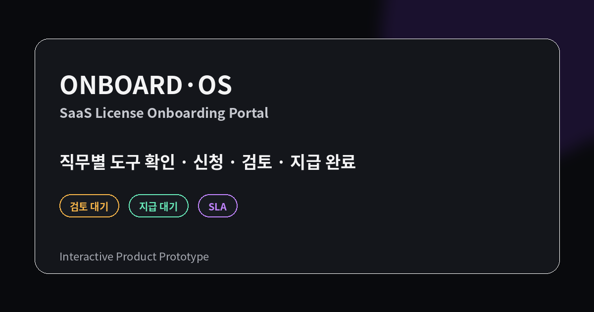
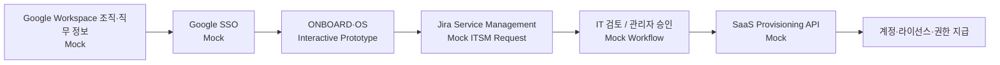
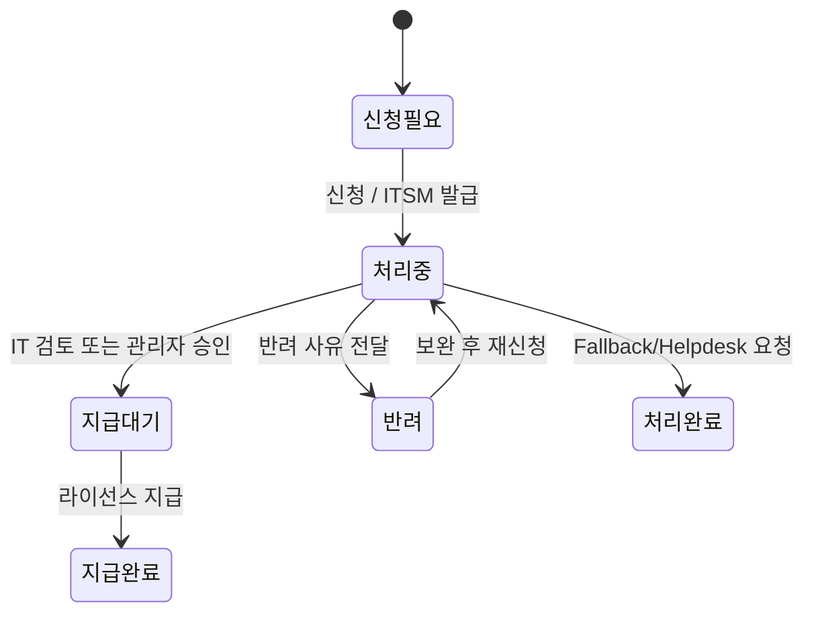

# ONBOARD·OS

신규입사자가 직무에 맞는 SaaS·업무 도구를 확인하고, 라이선스 **신청 → 검토·승인 → 지급 완료**까지의 흐름을 직접 체험할 수 있도록 설계한 인터랙티브 온보딩 포털 프로토타입입니다.

> 포트폴리오용 가상 데이터 기반 프로토타입입니다. Google SSO, Google Workspace 조직·직무 정보, Jira Service Management, SaaS Provisioning API는 실제 운영 환경을 가정한 Mock Flow이며 실제 계정·티켓 시스템과 연결되어 있지 않습니다.



[Live Demo](https://onboardos-rho.vercel.app/) · [Case Study / 운영 정책](https://dohyunkimm.notion.site/SaaS-38521460c93481498afce73336d4a17a)

## 주요 기능

- **가상 Google SSO 로그인** — 신규입사자 인증 시나리오 체험
- **직무별 라이선스 노출** — 디자인 / 개발 / 데이터 / 경영지원·총무 / 직무 미매핑 시나리오
- **전사 공통 + 직무별 추가 라이선스 구분** — 자동 지급과 신청·승인 필요 항목 분리
- **라이선스 신청 Flow** — 신청 사유, 예상 지급일, 담당 부서, SLA 확인
- **신청현황 Tracking** — 요청번호, 처리 상태, 이력, 반려 사유 확인
- **관리자 체험** — 검토, 승인, 반려, 지급 완료와 보완 대기 KPI
- **재신청 Flow** — 반려 사유 확인 → 보완 내용 입력 → 동일 요청 이력 기반 재접수
- **Fallback Flow** — 직무 미매핑과 목록 외 라이선스도 데모 ITSM 요청번호를 발급해 사용자/관리자에서 동일하게 추적
- **State Consistency** — 사용자/관리자에서 동일 요청 상태·티켓·이력 유지
- **SLA 상태** — 정상 / 마감 임박 / 초과 / 완료 상태를 같은 기준으로 표시
- **세션 상태 유지** — `sessionStorage` 기반 체험 상태 유지 및 명시적 초기화
- **Responsive & Accessibility** — PC/태블릿/모바일, focus trap, `aria-*`, `inert`, ESC 닫기, skip link, reduced motion + axe 자동 검사

## Prototype Architecture



## State Model



## SLA 기준

- 자동 지급: 계정 생성 후 **1시간 이내**
- 신청 필요: 영업일 기준 **D+1~2**
- 승인 필요: 영업일 기준 **D+2~3**

프로토타입의 영업일 계산은 **주말만 제외**합니다. 실제 운영 시에는 회사 영업일·공휴일 Calendar와 조직의 기준 시간대를 적용하는 것을 전제로 합니다.

## Tech Stack

- HTML5 / CSS3 / Vanilla JavaScript
- `sessionStorage`
- Vercel Web Analytics custom events
- Playwright E2E / axe WCAG A·AA / ARIA Snapshot / Visual Regression
- Firefox·WebKit Cross-browser Smoke / Production Smoke
- Lighthouse CI Performance Budget
- GitHub Actions Quality Gate
- GitHub → Vercel Production

프레임워크 없이 정적 웹 구조로 구현했으며, Vercel Production은 GitHub `main` 브랜치와 연결되어 있습니다.

## Project Structure

```text
.
├── index.html
├── styles.css
├── data.js
├── js/
│   ├── state.js
│   ├── analytics.js
│   └── a11y.js
├── app.js
├── og-image.png
├── icons/
│   └── *.svg
├── scripts/
│   ├── quality-check.js
│   └── serve.js
├── tests/
│   ├── onboard.spec.js
│   ├── accessibility.spec.js
│   ├── aria.spec.js
│   ├── aria.spec.js-snapshots/
│   ├── keyboard.spec.js
│   ├── domain.spec.js
│   ├── cross-browser.spec.js
│   ├── production.spec.js
│   ├── visual.spec.js
│   └── visual.spec.js-snapshots/
├── playwright.config.js
├── playwright.cross-browser.config.js
├── playwright.production.config.js
├── lighthouserc.cjs
├── package.json
├── package-lock.json
├── .github/workflows/e2e.yml
├── vercel.json
└── README.md
```

## Local Run

```bash
python3 -m http.server 8000
```

브라우저에서 `http://localhost:8000`으로 접속합니다.

## E2E QA

```bash
npm ci
npx playwright install chromium firefox webkit
npm run quality
npm run test:e2e
npm run test:cross-browser
npm run test:lighthouse
```

Playwright는 Desktop Chromium과 Mobile Chromium에서 다음 핵심 Flow를 검증합니다.

- 신청 → IT 검토 → 지급 완료 → reload 후 session 유지
- 승인 필요 → 반려 → 보완 → 재신청 → 관리자 승인
- 직무 미매핑 → ITSM 요청 생성 → 관리자 처리 완료
- 목록 외 라이선스 → IT 헬프데스크 ITSM 요청 생성

PR 및 `main` push에서 GitHub Actions가 데이터·CSP·소스 Quality Gate를 먼저 실행하고, 이후 기능 E2E·WCAG A/AA axe 검사·Keyboard/Focus Contract·ARIA Snapshot·Desktop/Mobile Visual Regression을 검증합니다. Firefox와 WebKit에서는 핵심 신청/관리자 Flow를 별도 Smoke로 확인하고, Lighthouse CI는 동일 화면을 3회 측정해 성능 Budget을 검사합니다.

`main` push에서는 위 로컬/정적 검증이 모두 통과한 뒤 **해당 commit의 Vercel status가 success인지 확인하고 실제 Production URL을 Chromium으로 열어** 핵심 Flow, CSP, 주요 asset 200, page/console error를 다시 검증합니다. Production Smoke 중 Analytics 전송 endpoint는 intercept하여 검증 트래픽이 지표를 오염시키지 않도록 합니다.

## Verification Matrix

| 검증 영역 | 자동 Gate | 범위 |
| --- | --- | --- |
| Business Flow | Playwright | 신청·검토/승인·반려·재신청·Fallback·지급 완료 |
| Domain Invariant | Playwright | 상태 전이·동일 ITSM 티켓·주말/월말/연말 SLA 경계 |
| Accessibility | axe + Playwright | WCAG 2.x A/AA 자동 규칙·Keyboard/Focus·ARIA Snapshot |
| Visual Regression | Playwright Screenshot | Desktop/Mobile 로그인·Dashboard·신청 Modal |
| Cross-browser | Playwright | Firefox/WebKit 핵심 신청·관리자 Flow |
| Performance | Lighthouse CI | 3회 측정·Performance/A11y/Best Practices/SEO·Web Vitals/byte budget |
| Production | Playwright + Vercel status | 실제 Production Flow·CSP·asset 200·page/console error |

## Observability & Security

- **Product events** — `Demo Login`, `Role Preview`, `License Request`, `License Resubmit`, `Fallback Request`, `Admin Review`, `License Complete`, `Fallback Complete`, `Case Study CTA`
- **Privacy boundary** — 이름·이메일·EMP ID·자유 입력 신청 사유는 Custom Event data에 넣지 않습니다.
- **Security headers** — 기존 보안 Header와 함께 CSP를 적용하고 `script-src-attr`/`style-src-attr`을 `none`으로 제한해 inline handler·style attribute 실행을 차단합니다.
- **Docs-only deploy skip** — Markdown 및 `docs/`만 변경된 commit은 Vercel Ignored Build Step에서 애플리케이션 배포를 건너뜁니다.

## Code Structure

`data.js`를 라이선스 카드 데이터의 단일 Source of Truth로 사용하며 `index.html`에는 카드 목록을 중복 하드코딩하지 않습니다. 런타임 책임은 `js/state.js`(세션·상태), `js/analytics.js`(이벤트), `js/a11y.js`(오버레이·포커스), `app.js`(화면·업무 Flow)로 분리했습니다.

## Deployment

```text
Feature Branch
    ↓
GitHub Pull Request + Playwright E2E
    ↓
Vercel Preview
    ↓
Merge to main
    ↓
Vercel Production
    ↓
onboardos-rho.vercel.app
```

## Prototype Scope

실제 SaaS 라이선스 발급 시스템이 아니라 아래 운영 시나리오를 검증하기 위한 Interactive Prototype입니다.

- 신규입사자의 직무 정보 기반 개인화
- 자동 지급 / 신청 / 승인 필요 항목의 구분
- Jira Service Management 요청번호 기반 Tracking 가정
- 사용자와 관리자 사이의 상태 일관성
- 반려·재신청과 직무 미매핑·목록 외 요청 Fallback
- SLA와 처리 이력의 가시성
- 모바일 환경을 포함한 주요 Service Flow

---

**기획 · 설계 · 프로토타입 구현: 김도현**
