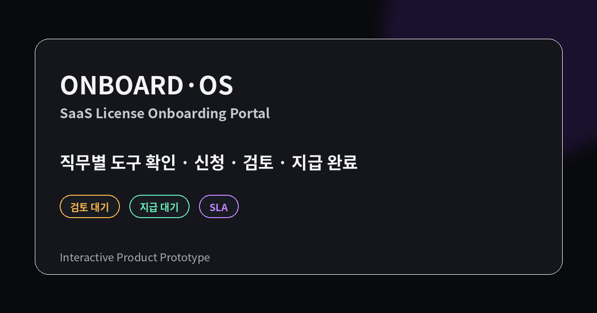

# ONBOARD·OS

[](https://github.com/dohyunkimmm/onboardos/actions/workflows/e2e.yml?query=branch%3Amain)

**신규입사자가 직무별 업무 도구를 확인하고, 라이선스 신청부터 승인·지급 완료까지 체험하는 온보딩 포털 프로토타입입니다.**

[36초 핵심 데모](https://onboardos-rho.vercel.app/production-demo) · [직접 체험](https://onboardos-rho.vercel.app/) · [Case Study](https://dohyunkimm.notion.site/SaaS-38521460c93481498afce73336d4a17a)

> **Portfolio release — v18.0.0 / P6 product-review candidate.** 2026-10-08 제품 검토 1~7 항목을 반영한 후보 상태입니다. 기존 v18.0.0 릴리스 영상과 검증 자료는 당시 버전의 기록이며, 이번 후보 변경 전체의 E2E·시각 회귀·Production 인증을 의미하지 않습니다.

## 핵심 사용자 흐름

`직무 선택 → 필요 도구 확인 → 신청 → IT 검토·관리자 승인 → 지급 완료`

- **직무별 도구:** 전사 공통·직무 도구와 필수·선택 항목, 준비 상태 구분
- **신청·추적:** 신청 목적·권한·기간 입력, 요청번호·상태·SLA·처리 이력 확인
- **관리자 체험:** 검토, 승인·반려, 보완 재신청, 지급 완료 처리
- **예외 대응:** 직무 미매핑·목록 외 요청, 세션 복원, 직무별 시나리오 상태 격리
- **접근성·반응형:** 키보드 조작, 스크린 리더 대응, 데스크톱·모바일 경험

## 실제 연동 범위

이 프로젝트는 **가상 데이터 기반 인터랙티브 프로토타입**입니다. Google SSO, Google Workspace 조직 정보, Jira Service Management 티켓, SaaS 계정·라이선스 발급은 실제 시스템에 연결되지 않은 모의 흐름입니다. 실제 회사의 라이선스 좌석·비용·설치 배포도 연동하지 않았습니다.

상태는 브라우저 `sessionStorage`에 시나리오별로 유지됩니다. SLA는 데모 정책이며 영업일 계산에서 주말만 제외합니다.

## 구현·검증

- **기술:** HTML, CSS, Vanilla JavaScript, Vercel, Playwright, axe, Lighthouse
- **품질:** 신청·관리자 흐름, 접근성, 시각 회귀, 복구·보안, 크로스 브라우저, 성능 검사
- **배포:** `main` → Vercel Production; 배포 자산의 SHA-256 무결성 및 브라우저 Smoke 검증
- **기록:** GitHub Actions에서 자동 검증 결과와 릴리스 근거를 확인할 수 있습니다.

```bash
npm ci
npm run quality
npm run test:e2e
```

## 자세히 보기

- [2–3분 체험 안내](docs/DEMO_WALKTHROUGH.md) · [2026-10-08 제품 검토](docs/PRODUCT_REVIEW_2026-10-08.md)
- [릴리스 이력](CHANGELOG.md) · [최신 CI 검증](https://github.com/dohyunkimmm/onboardos/actions/workflows/e2e.yml?query=branch%3Amain)
- [Production 수동 검증](https://github.com/dohyunkimmm/onboardos/actions/workflows/production-verify.yml)



**기획 · 설계 · 프로토타입 구현: 김도현**
